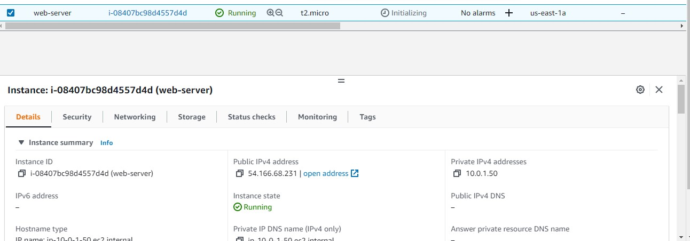
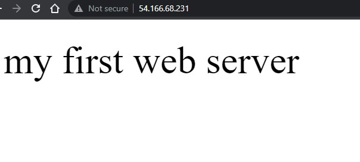

# Ubuntu and apache2 instance on aws wth terraform

## Steps

- Create VPC
- Create Internet gateway
- Create custom route table
- Create a subnet
- Associate subnet with route table
- Create Securtiy Group to allow port 22, 80, 443
- Create a network interface with an IP in the subnet that was created in step 4
- Assign an elastic ip to the the network interface created in 7
- Create Ubuntu and Install apache

## Initial and prerequisite

- Setup aws cloud account
- Get access key and credentials

## Setup instance

Set up terraform environment

```
terraform init
terraform apply -var-file variable.tfvars
```

### View EC2 instance created in your aws account



### Click on instance _web-server_ just created and you can either access the apache2 sever through

- Public Ip
- SSH



## Clean up : Destroy instance

```
  terraform destroy -var-file variable.tfvars
```
